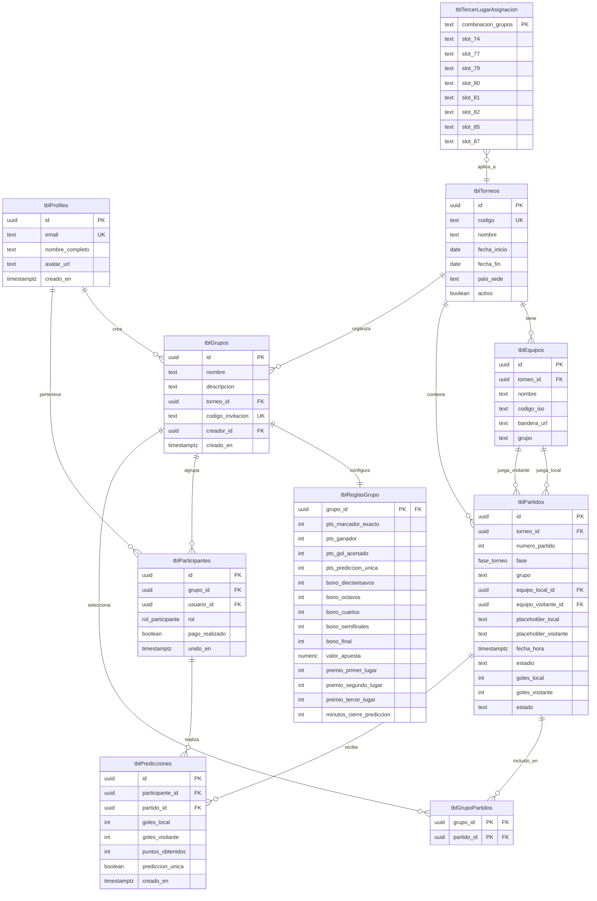

# Levantamiento de Requerimientos — Sistema de Pollas Deportivas

> **Inspirado en:** Pollamundial.org
> **Tipo:** Plataforma web responsiva + PWA
> **Audiencia:** Aficionados al fútbol que arman quinielas grupales para torneos completos

---

## 1. Visión General

Construir una plataforma web (con soporte PWA) que permita a los usuarios crear y participar en **quinielas grupales** sobre torneos de fútbol completos. Cada grupo (quiniela) está asociado a un torneo y tiene su propio conjunto de reglas de puntuación, partidos seleccionados y participantes.

El primer torneo soportado será el **Mundial 2026** (México, Estados Unidos y Canadá), pero la arquitectura debe permitir agregar futuros torneos sin refactorizaciones mayores.

### 1.1 Glosario

| Término | Definición |
|---|---|
| **Polla / Grupo / Quiniela** | Conjunto de participantes que apuestan sobre los mismos partidos bajo las mismas reglas. |
| **Torneo** | Competencia deportiva completa (ej. Mundial 2026) con sus partidos, fases y equipos. |
| **Predicción** | Marcador exacto que un usuario predice para un partido específico. |
| **Regla de puntuación** | Configuración que define cuántos puntos otorga cada tipo de acierto. |
| **Bono** | Puntos extra otorgados por aciertos en fases de eliminación directa. |
| **Premio %** | Porcentaje del pozo total que recibe el ganador de cada lugar. |
| **Admin de grupo** | Creador/gestor de una polla. Rol `admin` en `tblParticipantes`; privilegios solo sobre su grupo. No registra marcadores reales. Ver §4.6. |
| **Admin de plataforma** | Quien gestiona el torneo y registra los marcadores reales. Vía `service_role` / job, no es rol de grupo. Ver §4.6. |

---

## 2. Stack Tecnológico

### 2.1 Frontend
- **Framework:** Next.js 14+ (App Router)
- **Lenguaje:** TypeScript (strict mode)
- **Estilos:** Tailwind CSS
- **Componentes UI:** shadcn/ui (Radix UI primitives)
- **Iconos:** lucide-react
- **Formularios:** React Hook Form + Zod (validación)
- **Estado servidor:** TanStack Query (React Query)
- **Estado cliente:** Zustand (mínimo necesario)
- **PWA:** next-pwa o serwist
- **Notificaciones toast:** sonner

### 2.2 Backend / Infraestructura
- **BaaS:** Supabase
  - PostgreSQL (base de datos)
  - Supabase Auth (Google OAuth)
  - Row Level Security (RLS) — seguridad por filas
  - Storage (avatares, logos de equipos si aplica)
  - Edge Functions (cálculo de puntajes, jobs programados)
  - Realtime (actualización de tablas de posiciones en vivo)

### 2.3 Despliegue
- **Hosting:** Vercel
- **CI/CD:** GitHub Actions
- **Dominio:** TBD

---

## 3. Requerimientos No Funcionales

### 3.1 Compatibilidad y Responsive
- **100% usable en mobile** — diseño mobile-first.
- **300% compatible** con:
  - Android (Chrome, Samsung Internet, Firefox)
  - iPhone (Safari iOS — incluyendo Safe Areas, viewport-fit, `100dvh`)
  - Safari macOS
  - Chrome, Edge, Firefox desktop
- Soporte para iOS 15+ y Android 10+.

### 3.2 PWA
- Instalable en home screen (manifest.json + service worker).
- Iconos para iOS y Android en todas las resoluciones requeridas.
- Splash screens para iOS.
- Funcionalidad offline básica (visualización de partidos ya cargados, predicciones guardadas localmente).
- `theme-color` adaptado al modo claro/oscuro.

### 3.3 Performance
- Lighthouse score ≥ 90 en Performance, Accessibility, Best Practices, SEO.
- LCP < 2.5s, CLS < 0.1, FID < 100ms.
- Imágenes optimizadas (next/image).

### 3.4 Seguridad
- Autenticación obligatoria para todas las rutas protegidas (excepto landing/login).
- Row Level Security activado en todas las tablas.
- Validación tanto en cliente como en servidor (Zod schemas compartidos).
- Variables de entorno seguras (nunca exponer service_role key en cliente).

### 3.5 Accesibilidad
- WCAG 2.1 nivel AA mínimo.
- Soporte completo de teclado.
- ARIA labels donde corresponda.
- Contraste de color adecuado.

### 3.6 Internacionalización
- **Idioma único inicial:** Español (es-CO).
- Zona horaria default: **America/Bogota (UTC-5)**.
- Estructura preparada para i18n futuro (next-intl).

---

## 4. Requerimientos Funcionales

### 4.1 Autenticación

#### RF-AUTH-01 — Métodos de autenticación
La plataforma soporta dos métodos de inicio de sesión, ambos gestionados por Supabase Auth:

1. **Google OAuth** — un clic, sin formulario.
2. **Email + contraseña** — registro y login tradicional.

Al primer login (por cualquier método), se crea automáticamente un registro en `tblProfiles` con: `id`, `email`, `nombre_completo`, `avatar_url`.

El usuario puede cerrar sesión desde cualquier vista autenticada.

#### RF-AUTH-02 — Pantalla de login / registro
- Vista pública con branding del producto.
- **Tab "Iniciar sesión":**
  - Botón "Continuar con Google" (destacado arriba).
  - Separador visual ("o").
  - Campos: email, contraseña.
  - Link "¿Olvidaste tu contraseña?" → flujo de reset por email.
  - Botón "Iniciar sesión".
- **Tab "Crear cuenta":**
  - Botón "Continuar con Google" (destacado arriba).
  - Separador visual ("o").
  - Campos: nombre completo, email, contraseña, confirmar contraseña.
  - Validación de contraseña: mínimo 8 caracteres, al menos 1 número.
  - Checkbox de aceptación de términos (futuro: link a T&C).
  - Botón "Crear cuenta".
  - Tras registro: enviar email de verificación (Supabase Auth lo maneja). Mientras no se verifique, mostrar banner persistente con opción de reenviar.

#### RF-AUTH-03 — Recuperación de contraseña
- Vista `/forgot-password` con campo email.
- Supabase envía email con link de reset (template configurable en dashboard de Supabase).
- Vista `/reset-password` (a la que llega el link) con campos: contraseña nueva, confirmar.

#### RF-AUTH-04 — Protección de rutas
- Todas las rutas excepto `/login`, `/forgot-password`, `/reset-password` y `/` (landing) requieren sesión activa.
- Middleware de Next.js que redirija a `/login` si no hay sesión.
- Si el usuario no tiene email verificado y la ruta requiere verificación (futuro: ej. crear grupo con valor_apuesta > 0), redirigir a `/verificar-email`.

---

### 4.2 Dashboard Principal (post-login)

#### RF-DASH-01 — Acciones primarias
La pantalla principal tras el login muestra:
1. **Botón "Crear Grupo"** — abre el wizard de creación.
2. **Botón "Buscar Grupo"** — abre vista para unirse a un grupo existente (por código o búsqueda).
3. **Sección "Mis Grupos"** — listado de los grupos en los que el usuario participa.

#### RF-DASH-02 — Tarjeta de grupo en "Mis Grupos"
Cada tarjeta debe mostrar:
- Nombre del grupo.
- Torneo asociado (ej. "Mundial 2026").
- Cantidad de participantes.
- Posición actual del usuario en el grupo.
- Estado del grupo (Activo / Próximo / Finalizado).
- Acción: "Ver grupo" (navega al detalle).

---

### 4.3 Creación de Grupo (Wizard 3 fases)

> El flujo de creación es un **stepper / wizard** con indicador visual del paso actual (ej. `2/3`).

#### RF-CREAR-01 — Fase 1: Datos del grupo
Campos:
- **Nombre** (string, requerido, 3–50 caracteres, único por usuario creador)
- **Descripción** (string, opcional, máx 280 caracteres)

Validación con Zod. Botón "Siguiente" deshabilitado si hay errores.

> El torneo se asigna automáticamente al único torneo activo (Mundial 2026). Cuando se soporten múltiples torneos en el futuro, se agregará el selector aquí.

#### RF-CREAR-02 — Fase 2: Reglas de puntuación

> Esta fase replica la pantalla mostrada en la imagen 1 del briefing.

Cada campo es numérico (entero ≥ 0) con su tooltip explicativo:

| Campo | Tooltip | Default |
|---|---|---|
| **Marcador exacto acertado** | Si aciertas exactamente el marcador del partido se sumarán los puntos seleccionados. Se recomienda que este valor sea mayor que la suma de Gol y Ganador Acertado. | 5 |
| **Ganador acertado** | Si aciertas únicamente el ganador (o empate) del partido se sumarán los puntos seleccionados. | 2 |
| **Gol acertado** | Si aciertas el número exacto de goles de uno de los equipos. | 1 |
| **Predicción única** | Bono por ser el único en acertar el marcador exacto de un partido. | 2 |
| **Bono Dieciseisavos** | Puntos extra por acertar marcador exacto en partidos de Dieciseisavos. | 10 |
| **Bono octavos** | Puntos extra por acertar marcador exacto en partidos de Octavos. | 8 |
| **Bono cuartos** | Puntos extra por acertar marcador exacto en partidos de Cuartos. | 4 |
| **Bono semifinales** | Puntos extra por acertar marcador exacto en Semifinales. | 2 |
| **Bono final** | Puntos extra por acertar marcador exacto en la Final. | 5 |
| **Valor apuesta** | Monto en COP que paga cada participante al inscribirse al grupo (0 = grupo gratis). | 0 |
| **Premio 1er lugar %** | Porcentaje del pozo total para el primer lugar. | 60 |
| **Premio 2do lugar %** | Porcentaje del pozo total para el segundo lugar. | 30 |
| **Premio 3er lugar %** | Porcentaje del pozo total para el tercer lugar. | 10 |

**Validación cruzada:** `premio_1 + premio_2 + premio_3 = 100` (debe sumar exactamente 100%).

#### RF-CREAR-03 — Fase 3: Seleccionar Partidos

> Esta fase replica la pantalla mostrada en la imagen 2 del briefing.

- Se listan **todos los partidos del torneo** agrupados por fase:
  - Fase de Grupos (12 grupos: A–L)
  - Dieciseisavos de Final
  - Octavos de Final
  - Cuartos de Final
  - Semifinales
  - Tercer Lugar
  - Final
- Cada partido muestra:
  - ✅ Checkbox para incluirlo o no.
  - Bandera y nombre del equipo local.
  - Bandera y nombre del equipo visitante.
  - Fecha (formato: `MMM DD`).
  - Hora (zona horaria Colombia).
- Cada **fase completa** tiene un checkbox "padre" que selecciona/deselecciona todos los partidos de esa fase.
- Al iniciar el wizard, **todos los partidos están seleccionados por defecto**.
- Para fases posteriores a grupos, los partidos aparecen como "Por definir vs. Por definir" hasta que se determinen los clasificados (los datos de fase se completan dinámicamente).

#### RF-CREAR-04 — Confirmación y creación
- Botón "Crear grupo" al final del wizard.
- Al confirmar, se ejecuta una transacción que crea: grupo, reglas, partidos seleccionados, y agrega al creador como primer participante (rol: `admin`).
- Se genera un **código de invitación único** de 6 caracteres alfanuméricos.
- Redirección a la vista del grupo recién creado.

---

### 4.4 Buscar / Unirse a un Grupo

#### RF-BUSCAR-01 — Vista de búsqueda
- Campo de texto: "Ingresa el código del grupo".
- Botón "Buscar" → consulta el grupo por código.
- Si existe, muestra preview con nombre, torneo, descripción, número de participantes, valor apuesta.
- Botón "Unirme al grupo".

#### RF-BUSCAR-02 — Restricciones de ingreso
- Si el grupo ya tiene partidos en curso (la fecha del primer partido seleccionado ya pasó), el ingreso queda bloqueado.
- Si el usuario ya pertenece al grupo, se muestra mensaje informativo y opción de ir directamente a la vista del grupo.

---

### 4.5 Vista de Grupo (detalle)

#### RF-GRUPO-01 — Tabs principales
1. **Mis Predicciones** — formulario para ingresar/editar predicciones de cada partido.
2. **Tabla de Posiciones** — leaderboard del grupo en tiempo real.
3. **Partidos** — listado completo de partidos con marcador real (cuando aplique) y predicción del usuario.
4. **Reglas** — vista solo lectura de las reglas configuradas.
5. **Participantes** — lista de miembros del grupo con su puntaje acumulado.
6. **Configuración** (solo admin) — editar metadata del grupo, copiar código de invitación.

#### RF-GRUPO-02 — Predicciones
- Antes del partido: el usuario puede ingresar/editar su predicción (dos inputs numéricos: goles local / goles visitante).
- **Cierre de predicciones:** la predicción se bloquea automáticamente N minutos antes del kickoff (configurable, default 5 min).
- Después del partido: se muestra la predicción junto al marcador real, con badge de cuántos puntos obtuvo.

#### RF-GRUPO-02.1 — Estadísticas globales del partido (antes del cierre)

> Esta sección replica la pantalla mostrada en la imagen 1 del briefing.

En la vista de predicción de cada partido se debe mostrar un panel **"Todos los usuarios"** con estadísticas agregadas de **toda la plataforma** (todos los grupos, todos los usuarios) para ese partido específico:

- **Bloque "Ganador":** porcentaje de usuarios que predijeron victoria local / visitante / empate.
  - Ej: México 82.90% — Sudáfrica 4.64% — Empate 12.46%
  - Visualización: barras horizontales con el porcentaje al final.
- **Bloque "Resultados más comunes":** top 10 marcadores más predichos con su porcentaje.
  - Ej: 2-1 → 31.30%, 2-0 → 26.38%, 1-0 → 13.33%, etc.
  - Visualización: barras horizontales ordenadas de mayor a menor.

Estas estadísticas son **públicas y agregadas** (no exponen identidad de ningún usuario). Se calculan en tiempo real (o con cache de 1–5 minutos) consultando la tabla `tblPredicciones` agrupada por partido.

#### RF-GRUPO-02.2 — Estadísticas del grupo (antes del cierre)

> Esta sección replica el comportamiento mostrado en la imagen 2 del briefing.

En la misma vista de predicción se muestra un panel **"Predicciones de mi grupo"** con las estadísticas agregadas de **solo los participantes del grupo actual**:

- **Mientras la apuesta esté abierta** (partido aún no inicia y no se cumple el cierre):
  - Mostrar mensaje: *"Las predicciones de tus amigos son secretas. Estarán disponibles luego de que se cierre la apuesta."*
  - **Opcionalmente** mostrar estadísticas agregadas anónimas del grupo (ganador % y top marcadores %), siguiendo el mismo formato del panel global pero filtrado al grupo. Esto se mostrará si el grupo tiene **al menos 5 participantes** que ya hayan predicho (umbral mínimo de privacidad).
  - **En ningún caso** se revela qué usuario hizo qué predicción antes del cierre.

#### RF-GRUPO-02.3 — Predicciones del grupo (después del cierre)

Una vez la apuesta del partido se cierre (kickoff alcanzado / partido en vivo o finalizado):

- Se muestra una **lista nominal** de las predicciones de todos los participantes del grupo:
  - Avatar + nombre del participante.
  - Marcador que predijo (ej. "2 - 1").
  - Si el partido ya está finalizado: badge de puntos obtenidos al lado.
- Esta lista NO se muestra antes del cierre bajo ninguna circunstancia.
- Lista ordenada por puntos obtenidos (desc) si el partido está finalizado, o alfabética por nombre si está en curso.

#### RF-GRUPO-03 — Cálculo de puntajes
- Trigger: cuando se registra el **marcador real** de un partido.
- ⚠️ **Quién registra el marcador real:** SOLO el **administrador de plataforma** (`service_role`)
  o un job automático. **Nunca** el administrador de un grupo — los resultados reales son globales
  del torneo (afectan a todos los grupos que apuestan ese partido), así que permitir que el
  creador de una polla los fije sería una falla de integridad. Ver §4.6 (Roles) para la distinción
  entre *admin de grupo* y *admin de plataforma*.
- Una Edge Function calcula los puntos de todos los participantes para ese partido según las reglas del grupo.
- Se actualiza la tabla `tblPredicciones` con `puntos_obtenidos`.
- Se invalida la cache de la tabla de posiciones.

---

### 4.6 Roles y permisos

La plataforma maneja **tres figuras distintas**. Las dos primeras son roles _dentro de un grupo_
(viven en `tblParticipantes.rol`); la tercera es transversal a la plataforma.

| Figura | Alcance | Cómo se identifica | Puede |
|---|---|---|---|
| **Participante (jugador)** | Un grupo | `tblParticipantes.rol = 'jugador'` (default) | Unirse a grupos, predecir, ver tabla/estadísticas/reglas. |
| **Admin de grupo** | Solo *su* grupo | `tblParticipantes.rol = 'admin'` (lo recibe el creador en RF-CREAR-04) | Todo lo de jugador + editar metadata del grupo, gestionar miembros, copiar código de invitación. **NO** registra marcadores reales. |
| **Admin de plataforma** | Todo el sistema | `service_role` (server-side) o un job programado | Cargar torneos/equipos/partidos, **registrar marcadores reales**, disparar cálculo de puntajes y cierre de fase de grupos. |

Notas:
- Un mismo usuario puede ser `admin` en un grupo y `jugador` en otro: el rol es por grupo, no global.
- El **admin de plataforma NO es un rol de `tblParticipantes`** ni una bandera en `tblProfiles` en
  el MVP. Se materializa vía `service_role` (RLS §5.4): el panel de registro de resultados (Fase 8)
  es una superficie server-side / admin, no accesible a usuarios normales. Si en el futuro se
  requiere delegar esta función a usuarios específicos sin `service_role`, se evaluará agregar una
  tabla `tblAdminsPlataforma` o un claim de rol — **fuera de scope inicial**.
- **Regla de integridad:** los marcadores reales (`tblPartidos.goles_*`, `estado`) solo se escriben
  con `service_role`. Ningún admin de grupo puede modificarlos (ver RF-GRUPO-03 y §5.4).

---

## 5. Modelo de Datos

> SQL pensado para PostgreSQL / Supabase. Todos los timestamps son `timestamptz`. UUIDs por defecto.

### 5.1 Diagrama de entidades (resumen)

```
tblProfiles (1) ─── (N) tblParticipantes (N) ─── (1) tblGrupos (N) ─── (1) tblTorneos
                                              │                    │
                                              │                    └─ (N) tblPartidos (N) ─ (1) tblEquipos
                                              │                                     │
                                              ├─ (1) tblReglasGrupo                  │
                                              └─ (N) tblGrupoPartidos ────────────────┘
                                                              │
                                                              └─ (N) tblPredicciones (N) ─ (1) tblParticipantes
```

### 5.1.1 Diagrama Entidad-Relación (ERD)

> Diagrama renderizable en GitHub, GitLab y la mayoría de visores de Markdown vía Mermaid.



**Notas sobre el ERD:**
- `||--o{` = uno a muchos · `||--||` = uno a uno · `}o--||` = muchos a uno opcional.
- Las **vistas** (`vwTablaPosiciones`, `vwEstadisticasPartido*`, `vwPrediccionesGrupoPartido`) NO aparecen en el ERD porque son consultas derivadas, no tablas físicas.
- `tblPartidos.equipo_local_id` y `tblPartidos.equipo_visitante_id` son **opcionales** (nullable) — quedan en `null` para los partidos eliminatorios hasta que se resuelvan los cruces. Los `placeholder_*` los reemplazan en UI mientras tanto.
- `tblPredicciones` cuelga de `tblParticipantes` (no de `tblProfiles`) porque una predicción siempre vive en el contexto de un grupo. Un mismo usuario puede tener predicciones distintas en grupos distintos para el mismo partido.
- **Convención de nombres:** todas las tablas usan prefijo `tbl` en camelCase (ej. `tblProfiles`, `tblReglasGrupo`). Como PostgreSQL es case-sensitive con identificadores que tienen mayúsculas, en SQL siempre van **entre comillas dobles**: `"tblProfiles"`. Las vistas usan prefijo `vw` con la misma convención.

### 5.2 Tablas

#### `tblProfiles`
Extiende `auth.users` de Supabase.

```sql
create table public."tblProfiles" (
  id uuid primary key references auth.users(id) on delete cascade,
  email text not null unique,
  nombre_completo text,
  avatar_url text,
  creado_en timestamptz default now() not null,
  actualizado_en timestamptz default now() not null
);
```

#### `tblTorneos`
Catálogo de torneos disponibles (Mundial 2026, futuras Copa América, etc.).

```sql
create table public."tblTorneos" (
  id uuid primary key default gen_random_uuid(),
  codigo text not null unique,           -- ej. 'mundial-2026'
  nombre text not null,                  -- ej. 'Mundial 2026'
  descripcion text,
  fecha_inicio date not null,
  fecha_fin date not null,
  pais_sede text,
  activo boolean default true not null,
  creado_en timestamptz default now() not null
);
```

#### `tblEquipos`
Selecciones / equipos participantes.

```sql
create table public."tblEquipos" (
  id uuid primary key default gen_random_uuid(),
  torneo_id uuid not null references public."tblTorneos"(id) on delete cascade,
  nombre text not null,                  -- ej. 'Colombia'
  codigo_iso text,                       -- ej. 'COL'
  bandera_url text,                      -- url al svg/png de la bandera
  grupo text,                            -- 'A','B',...,'L' (null si es post-grupos)
  creado_en timestamptz default now() not null,
  unique (torneo_id, nombre)
);
```

#### `tblPartidos`
Catálogo maestro de partidos del torneo.

```sql
create type fase_torneo as enum (
  'fase_grupos',
  'dieciseisavos',
  'octavos',
  'cuartos',
  'semifinales',
  'tercer_lugar',
  'final'
);

create table public."tblPartidos" (
  id uuid primary key default gen_random_uuid(),
  torneo_id uuid not null references public."tblTorneos"(id) on delete cascade,
  numero_partido int not null,           -- 1..104 para Mundial 2026
  fase fase_torneo not null,
  grupo text,                            -- 'A'..'L' si es fase de grupos
  equipo_local_id uuid references public."tblEquipos"(id),
  equipo_visitante_id uuid references public."tblEquipos"(id),
  -- placeholders para cuando los equipos no estén definidos aún
  placeholder_local text,                -- ej. '2A','G74','3ABCDF'
  placeholder_visitante text,
  fecha_hora timestamptz not null,       -- guardar en UTC, render en America/Bogota
  estadio text,
  ciudad text,
  goles_local int,                       -- null hasta que se juegue
  goles_visitante int,
  estado text default 'programado' not null
    check (estado in ('programado','en_vivo','finalizado','cancelado')),
  creado_en timestamptz default now() not null,
  unique (torneo_id, numero_partido)
);

create index on public."tblPartidos" (torneo_id, fecha_hora);
create index on public."tblPartidos" (torneo_id, fase);
```

#### `tblGrupos`
Las pollas / quinielas creadas por usuarios.

```sql
create table public."tblGrupos" (
  id uuid primary key default gen_random_uuid(),
  nombre text not null,
  descripcion text,
  torneo_id uuid not null references public."tblTorneos"(id) on delete restrict,
  codigo_invitacion text not null unique, -- 6 chars alfanuméricos
  creador_id uuid not null references public."tblProfiles"(id) on delete restrict,
  creado_en timestamptz default now() not null,
  actualizado_en timestamptz default now() not null
);

create index on public."tblGrupos" (creador_id);
create index on public."tblGrupos" (torneo_id);
```

#### `tblReglasGrupo`
Reglas de puntuación 1-1 con cada grupo.

```sql
create table public."tblReglasGrupo" (
  grupo_id uuid primary key references public."tblGrupos"(id) on delete cascade,
  pts_marcador_exacto int not null default 5 check (pts_marcador_exacto >= 0),
  pts_ganador int not null default 2 check (pts_ganador >= 0),
  pts_gol_acertado int not null default 1 check (pts_gol_acertado >= 0),
  pts_prediccion_unica int not null default 2 check (pts_prediccion_unica >= 0),
  bono_dieciseisavos int not null default 10 check (bono_dieciseisavos >= 0),
  bono_octavos int not null default 8 check (bono_octavos >= 0),
  bono_cuartos int not null default 4 check (bono_cuartos >= 0),
  bono_semifinales int not null default 2 check (bono_semifinales >= 0),
  bono_final int not null default 5 check (bono_final >= 0),
  valor_apuesta numeric(12,2) not null default 0 check (valor_apuesta >= 0),
  premio_primer_lugar int not null default 60 check (premio_primer_lugar between 0 and 100),
  premio_segundo_lugar int not null default 30 check (premio_segundo_lugar between 0 and 100),
  premio_tercer_lugar int not null default 10 check (premio_tercer_lugar between 0 and 100),
  minutos_cierre_prediccion int not null default 5 check (minutos_cierre_prediccion >= 0),
  constraint suma_premios_100 check (
    premio_primer_lugar + premio_segundo_lugar + premio_tercer_lugar = 100
  ),
  creado_en timestamptz default now() not null,
  actualizado_en timestamptz default now() not null
);
```

#### `tblGrupoPartidos`
Relación N-N que define qué partidos se apuestan en cada grupo.

```sql
create table public."tblGrupoPartidos" (
  grupo_id uuid not null references public."tblGrupos"(id) on delete cascade,
  partido_id uuid not null references public."tblPartidos"(id) on delete cascade,
  primary key (grupo_id, partido_id)
);

create index on public."tblGrupoPartidos" (partido_id);
```

#### `tblParticipantes`
Usuarios que pertenecen a cada grupo.

```sql
create type rol_participante as enum ('admin','jugador');

create table public."tblParticipantes" (
  id uuid primary key default gen_random_uuid(),
  grupo_id uuid not null references public."tblGrupos"(id) on delete cascade,
  usuario_id uuid not null references public."tblProfiles"(id) on delete cascade,
  rol rol_participante not null default 'jugador',
  pago_realizado boolean default false not null,
  unido_en timestamptz default now() not null,
  unique (grupo_id, usuario_id)
);

create index on public."tblParticipantes" (usuario_id);
```

#### `tblPredicciones`
Predicciones de cada participante por partido.

```sql
create table public."tblPredicciones" (
  id uuid primary key default gen_random_uuid(),
  participante_id uuid not null references public."tblParticipantes"(id) on delete cascade,
  partido_id uuid not null references public."tblPartidos"(id) on delete cascade,
  goles_local int not null check (goles_local >= 0),
  goles_visitante int not null check (goles_visitante >= 0),
  puntos_obtenidos int default 0 not null,
  predicccion_unica boolean default false not null, -- true si fue el único en acertar el marcador
  creado_en timestamptz default now() not null,
  actualizado_en timestamptz default now() not null,
  unique (participante_id, partido_id)
);

create index on public."tblPredicciones" (partido_id);
```

### 5.3 Vistas

#### `vwTablaPosiciones`
Tabla de posiciones agregada por grupo.

```sql
create or replace view public."vwTablaPosiciones" as
select
  p.grupo_id,
  p.id as participante_id,
  prof.nombre_completo,
  prof.avatar_url,
  coalesce(sum(pred.puntos_obtenidos), 0) as puntos_totales,
  count(pred.id) filter (where pred.puntos_obtenidos > 0) as aciertos,
  rank() over (
    partition by p.grupo_id
    order by coalesce(sum(pred.puntos_obtenidos), 0) desc
  ) as posicion
from public."tblParticipantes" p
join public."tblProfiles" prof on prof.id = p.usuario_id
left join public."tblPredicciones" pred on pred.participante_id = p.id
group by p.grupo_id, p.id, prof.nombre_completo, prof.avatar_url;
```

#### `vwEstadisticasPartido*Global`
Estadísticas agregadas por partido considerando **todas las predicciones de la plataforma** (todos los grupos, todos los usuarios). Usada en el panel "Todos los usuarios" antes del cierre del partido.

```sql
-- Distribución de ganador (local / visitante / empate)
create or replace view public."vwEstadisticasPartidoGanadorGlobal" as
select
  partido_id,
  count(*) as total_predicciones,
  count(*) filter (where goles_local > goles_visitante) as predicciones_local,
  count(*) filter (where goles_local < goles_visitante) as predicciones_visitante,
  count(*) filter (where goles_local = goles_visitante) as predicciones_empate,
  round(
    100.0 * count(*) filter (where goles_local > goles_visitante) / nullif(count(*),0),
    2
  ) as pct_local,
  round(
    100.0 * count(*) filter (where goles_local < goles_visitante) / nullif(count(*),0),
    2
  ) as pct_visitante,
  round(
    100.0 * count(*) filter (where goles_local = goles_visitante) / nullif(count(*),0),
    2
  ) as pct_empate
from public."tblPredicciones"
group by partido_id;

-- Top marcadores predichos por partido
create or replace view public."vwEstadisticasPartidoMarcadoresGlobal" as
select
  partido_id,
  goles_local,
  goles_visitante,
  count(*) as cantidad,
  round(
    100.0 * count(*) / sum(count(*)) over (partition by partido_id),
    2
  ) as porcentaje
from public."tblPredicciones"
group by partido_id, goles_local, goles_visitante;
```

> **Performance:** estas vistas se consultan filtrando por `partido_id`. Si la plataforma crece a millones de predicciones, considerar materializarlas y refrescar cada N minutos vía cron.

#### `vwEstadisticasPartido*Grupo`
Mismas estadísticas pero filtradas por grupo. Usada en el panel "Predicciones de mi grupo" cuando se permite mostrar agregados anónimos antes del cierre.

```sql
-- Distribución de ganador por partido y grupo
create or replace view public."vwEstadisticasPartidoGanadorGrupo" as
select
  gp.grupo_id,
  pred.partido_id,
  count(*) as total_predicciones,
  count(*) filter (where pred.goles_local > pred.goles_visitante) as predicciones_local,
  count(*) filter (where pred.goles_local < pred.goles_visitante) as predicciones_visitante,
  count(*) filter (where pred.goles_local = pred.goles_visitante) as predicciones_empate,
  round(
    100.0 * count(*) filter (where pred.goles_local > pred.goles_visitante) / nullif(count(*),0),
    2
  ) as pct_local,
  round(
    100.0 * count(*) filter (where pred.goles_local < pred.goles_visitante) / nullif(count(*),0),
    2
  ) as pct_visitante,
  round(
    100.0 * count(*) filter (where pred.goles_local = pred.goles_visitante) / nullif(count(*),0),
    2
  ) as pct_empate
from public."tblPredicciones" pred
join public."tblParticipantes" p on p.id = pred.participante_id
join public."tblGrupoPartidos" gp on gp.grupo_id = p.grupo_id and gp.partido_id = pred.partido_id
group by gp.grupo_id, pred.partido_id;

-- Top marcadores por partido y grupo
create or replace view public."vwEstadisticasPartidoMarcadoresGrupo" as
select
  gp.grupo_id,
  pred.partido_id,
  pred.goles_local,
  pred.goles_visitante,
  count(*) as cantidad,
  round(
    100.0 * count(*) / sum(count(*)) over (partition by gp.grupo_id, pred.partido_id),
    2
  ) as porcentaje
from public."tblPredicciones" pred
join public."tblParticipantes" p on p.id = pred.participante_id
join public."tblGrupoPartidos" gp on gp.grupo_id = p.grupo_id and gp.partido_id = pred.partido_id
group by gp.grupo_id, pred.partido_id, pred.goles_local, pred.goles_visitante;
```

#### `vwPrediccionesGrupoPartido`
Vista nominal usada **solo después del cierre** del partido. Muestra qué predijo cada participante del grupo. La RLS controla cuándo es accesible.

```sql
create or replace view public."vwPrediccionesGrupoPartido" as
select
  p.grupo_id,
  pred.partido_id,
  p.id as participante_id,
  prof.id as usuario_id,
  prof.nombre_completo,
  prof.avatar_url,
  pred.goles_local,
  pred.goles_visitante,
  pred.puntos_obtenidos,
  pred.predicccion_unica
from public."tblPredicciones" pred
join public."tblParticipantes" p on p.id = pred.participante_id
join public."tblProfiles" prof on prof.id = p.usuario_id;
```

### 5.4 Row Level Security (RLS)

> Todas las tablas con datos de usuarios deben tener RLS activado.

**Patrón general:**
- `tblProfiles`: cada usuario lee/edita solo su propio registro.
- `tblGrupos`: lectura pública por código de invitación; escritura solo por creador.
- `tblParticipantes`: cada usuario ve solo los grupos en los que participa.
- `tblPredicciones`:
  - Cada usuario lee/edita **solo sus propias** predicciones cuando la apuesta está abierta.
  - Los demás miembros del grupo pueden leer las predicciones nominales de otros **solo después del cierre** (cuando `now() >= partidos.fecha_hora - reglas_grupo.minutos_cierre_prediccion`).
  - Las vistas `vw_estadisticas_partido_*_global` son legibles por cualquier usuario autenticado (datos agregados sin PII).
  - La vista `vw_estadisticas_partido_*_grupo` es legible solo por miembros del grupo.
- `tblPartidos`, `tblEquipos`, `tblTorneos`: lectura pública para usuarios autenticados; escritura solo por rol `service_role` (admin del sistema).

Las políticas concretas se definirán en migraciones SQL siguiendo el patrón **deny by default**.

---

## 6. Datos Iniciales (Seed)

### 6.1 Torneo Mundial 2026

```sql
insert into public."tblTorneos" (codigo, nombre, fecha_inicio, fecha_fin, pais_sede)
values ('mundial-2026', 'Mundial 2026', '2026-06-11', '2026-07-19', 'USA / México / Canadá');
```

### 6.2 Grupos del Mundial 2026

| Grupo | Equipos |
|---|---|
| **A** | México, Sudáfrica, Corea del Sur, Chequia |
| **B** | Canadá, Bosnia & Herzegovina, Catar, Suiza |
| **C** | Brasil, Marruecos, Haití, Escocia |
| **D** | Estados Unidos, Paraguay, Australia, Turquía |
| **E** | Alemania, Curazao, Costa de Marfil, Ecuador |
| **F** | Países Bajos, Japón, Suecia, Túnez |
| **G** | Bélgica, Egipto, Irán, Nueva Zelanda |
| **H** | España, Cabo Verde, Arabia Saudita, Uruguay |
| **I** | Francia, Senegal, Irak, Noruega |
| **J** | Argentina, Argelia, Austria, Jordania |
| **K** | Portugal, RD Congo, Uzbekistán, Colombia |
| **L** | Inglaterra, Croacia, Ghana, Panamá |

### 6.3 Calendario completo de partidos del Mundial 2026

> **Zona horaria: America/Bogota (UTC-5)**.
> Fuente: FIFA / TUDN (sorteo del 5 de diciembre de 2025).
> Horarios convertidos desde Centro de México (UTC-6) → Colombia (UTC-5) sumando 1 hora.

#### Fase de Grupos (72 partidos)

##### Jueves 11 de junio
| # | Grupo | Local | Visitante | Hora COL | Estadio |
|---|---|---|---|---|---|
| 1 | A | México | Sudáfrica | 14:00 | Ciudad de México |
| 2 | A | Corea del Sur | Chequia | 21:00 | Guadalajara |

##### Viernes 12 de junio
| # | Grupo | Local | Visitante | Hora COL | Estadio |
|---|---|---|---|---|---|
| 3 | B | Canadá | Bosnia & Herzegovina | 14:00 | Toronto |
| 4 | D | Estados Unidos | Paraguay | 20:00 | Los Angeles |

##### Sábado 13 de junio
| # | Grupo | Local | Visitante | Hora COL | Estadio |
|---|---|---|---|---|---|
| 8 | B | Catar | Suiza | 14:00 | San Francisco |
| 7 | C | Brasil | Marruecos | 17:00 | Nueva York / Nueva Jersey |
| 5 | C | Haití | Escocia | 20:00 | Boston |
| 6 | D | Australia | Turquía | 23:00 | Vancouver |

##### Domingo 14 de junio
| # | Grupo | Local | Visitante | Hora COL | Estadio |
|---|---|---|---|---|---|
| 10 | E | Alemania | Curazao | 12:00 | Houston |
| 11 | F | Países Bajos | Japón | 15:00 | Dallas |
| 9 | E | Costa de Marfil | Ecuador | 18:00 | Filadelfia |
| 12 | F | Suecia | Túnez | 21:00 | Monterrey |

##### Lunes 15 de junio
| # | Grupo | Local | Visitante | Hora COL | Estadio |
|---|---|---|---|---|---|
| 14 | H | España | Cabo Verde | 11:00 | Atlanta |
| 16 | G | Bélgica | Egipto | 14:00 | Seattle |
| 13 | H | Arabia Saudita | Uruguay | 17:00 | Miami |
| 15 | G | Irán | Nueva Zelanda | 20:00 | Los Angeles |

##### Martes 16 de junio
| # | Grupo | Local | Visitante | Hora COL | Estadio |
|---|---|---|---|---|---|
| 17 | I | Francia | Senegal | 14:00 | Nueva York / Nueva Jersey |
| 18 | I | Irak | Noruega | 17:00 | Boston |
| 19 | J | Argentina | Argelia | 20:00 | Kansas City |
| 20 | J | Austria | Jordania | 23:00 | San Francisco |

##### Miércoles 17 de junio
| # | Grupo | Local | Visitante | Hora COL | Estadio |
|---|---|---|---|---|---|
| 23 | K | Portugal | RD Congo | 12:00 | Houston |
| 22 | L | Inglaterra | Croacia | 15:00 | Dallas |
| 21 | L | Ghana | Panamá | 18:00 | Toronto |
| 24 | K | Uzbekistán | Colombia | 21:00 | Ciudad de México |

##### Jueves 18 de junio
| # | Grupo | Local | Visitante | Hora COL | Estadio |
|---|---|---|---|---|---|
| 25 | A | Chequia | Sudáfrica | 11:00 | Atlanta |
| 26 | B | Suiza | Bosnia & Herzegovina | 14:00 | Los Angeles |
| 27 | B | Canadá | Catar | 17:00 | Vancouver |
| 28 | A | México | Corea del Sur | 20:00 | Guadalajara |

##### Viernes 19 de junio
| # | Grupo | Local | Visitante | Hora COL | Estadio |
|---|---|---|---|---|---|
| 32 | D | Estados Unidos | Australia | 14:00 | Seattle |
| 30 | C | Escocia | Marruecos | 17:00 | Boston |
| 29 | C | Brasil | Haití | 20:00 | Filadelfia |
| 31 | D | Turquía | Paraguay | 23:00 | San Francisco |

##### Sábado 20 de junio
| # | Grupo | Local | Visitante | Hora COL | Estadio |
|---|---|---|---|---|---|
| 35 | F | Países Bajos | Suecia | 12:00 | Houston |
| 33 | E | Alemania | Costa de Marfil | 15:00 | Toronto |
| 34 | E | Ecuador | Curazao | 19:00 | Kansas City |
| 36 | F | Túnez | Japón | 23:00 | Monterrey |

##### Domingo 21 de junio
| # | Grupo | Local | Visitante | Hora COL | Estadio |
|---|---|---|---|---|---|
| 38 | H | España | Arabia Saudita | 11:00 | Atlanta |
| 39 | G | Bélgica | Irán | 14:00 | Los Angeles |
| 37 | H | Uruguay | Cabo Verde | 17:00 | Miami |
| 40 | G | Nueva Zelanda | Egipto | 20:00 | Vancouver |

##### Lunes 22 de junio
| # | Grupo | Local | Visitante | Hora COL | Estadio |
|---|---|---|---|---|---|
| 43 | J | Argentina | Austria | 12:00 | Dallas |
| 42 | I | Francia | Irak | 16:00 | Filadelfia |
| 41 | I | Noruega | Senegal | 19:00 | Nueva York / Nueva Jersey |
| 44 | J | Jordania | Argelia | 22:00 | San Francisco |

##### Martes 23 de junio
| # | Grupo | Local | Visitante | Hora COL | Estadio |
|---|---|---|---|---|---|
| 47 | K | Portugal | Uzbekistán | 12:00 | Houston |
| 45 | L | Inglaterra | Ghana | 15:00 | Boston |
| 46 | L | Panamá | Croacia | 18:00 | Toronto |
| 48 | K | Colombia | RD Congo | 21:00 | Guadalajara |

##### Miércoles 24 de junio
| # | Grupo | Local | Visitante | Hora COL | Estadio |
|---|---|---|---|---|---|
| 51 | B | Suiza | Canadá | 14:00 | Vancouver |
| 52 | B | Bosnia & Herzegovina | Catar | 14:00 | Seattle |
| 49 | C | Escocia | Brasil | 17:00 | Miami |
| 50 | C | Marruecos | Haití | 17:00 | Atlanta |
| 53 | A | Chequia | México | 20:00 | Ciudad de México |
| 54 | A | Sudáfrica | Corea del Sur | 20:00 | Monterrey |

##### Jueves 25 de junio
| # | Grupo | Local | Visitante | Hora COL | Estadio |
|---|---|---|---|---|---|
| 55 | E | Curazao | Costa de Marfil | 15:00 | Filadelfia |
| 56 | E | Ecuador | Alemania | 15:00 | Nueva York / Nueva Jersey |
| 57 | F | Japón | Suecia | 18:00 | Dallas |
| 58 | F | Túnez | Países Bajos | 18:00 | Kansas City |
| 59 | D | Turquía | Estados Unidos | 21:00 | Los Angeles |
| 60 | D | Paraguay | Australia | 21:00 | San Francisco |

##### Viernes 26 de junio
| # | Grupo | Local | Visitante | Hora COL | Estadio |
|---|---|---|---|---|---|
| 61 | I | Noruega | Francia | 14:00 | Boston |
| 62 | I | Senegal | Irak | 14:00 | Toronto |
| 65 | H | Cabo Verde | Arabia Saudita | 19:00 | Houston |
| 66 | H | Uruguay | España | 19:00 | Guadalajara |
| 63 | G | Egipto | Irán | 22:00 | Seattle |
| 64 | G | Nueva Zelanda | Bélgica | 22:00 | Vancouver |

##### Sábado 27 de junio
| # | Grupo | Local | Visitante | Hora COL | Estadio |
|---|---|---|---|---|---|
| 67 | L | Panamá | Inglaterra | 16:00 | Nueva York / Nueva Jersey |
| 68 | L | Croacia | Ghana | 16:00 | Filadelfia |
| 71 | K | Colombia | Portugal | 18:30 | Miami |
| 72 | K | RD Congo | Uzbekistán | 18:30 | Atlanta |
| 69 | J | Argelia | Austria | 21:00 | Kansas City |
| 70 | J | Jordania | Argentina | 21:00 | Dallas |

#### Dieciseisavos de Final (28 jun – 3 jul)

> **Notación de placeholders:** `1A` = primero del Grupo A, `2B` = segundo del Grupo B, `3ABCDF` = tercero clasificado proveniente de uno de los grupos A/B/C/D/F (la asignación específica depende de qué 4 de esos 5 grupos clasifican entre los mejores terceros). Ver sección 6.4 — Lógica de cruces.

| # | Cruce (oficial FIFA) | Fecha | Hora COL | Estadio |
|---|---|---|---|---|
| 73 | 2A vs. 2B | Dom 28 jun | 14:00 | Los Angeles |
| 76 | 1C vs. 2F | Lun 29 jun | 12:00 | Houston |
| 74 | 1E vs. 3ABCDF | Lun 29 jun | 15:30 | Boston |
| 75 | 1F vs. 2C | Lun 29 jun | 20:00 | Monterrey |
| 78 | 2E vs. 2I | Mar 30 jun | 12:00 | Dallas |
| 77 | 1I vs. 3CDFGH | Mar 30 jun | 16:00 | Nueva York / Nueva Jersey |
| 79 | 1A vs. 3CEFHI | Mar 30 jun | 20:00 | Ciudad de México |
| 80 | 1L vs. 3EHIJK | Mié 1 jul | 11:00 | Atlanta |
| 82 | 1G vs. 3AEHIJ | Mié 1 jul | 15:00 | Seattle |
| 81 | 1D vs. 3BEFIJ | Mié 1 jul | 19:00 | San Francisco |
| 84 | 1H vs. 2J | Jue 2 jul | 14:00 | Los Angeles |
| 83 | 2K vs. 2L | Jue 2 jul | 18:00 | Toronto |
| 85 | 1B vs. 3EFGIJ | Jue 2 jul | 20:00 | Vancouver |
| 88 | 2D vs. 2G | Vie 3 jul | 13:00 | Dallas |
| 86 | 1J vs. 2H | Vie 3 jul | 17:00 | Miami |
| 87 | 1K vs. 3DEIJL | Vie 3 jul | 20:30 | Kansas City |

#### Octavos de Final (4 – 7 jul)

| # | Cruce | Fecha | Hora COL | Estadio |
|---|---|---|---|---|
| 90 | Ganador P73 vs. Ganador P75 | Sáb 4 jul | 12:00 | Houston |
| 89 | Ganador P74 vs. Ganador P77 | Sáb 4 jul | 16:00 | Filadelfia |
| 91 | Ganador P76 vs. Ganador P78 | Dom 5 jul | 15:00 | Nueva York / Nueva Jersey |
| 92 | Ganador P79 vs. Ganador P80 | Dom 5 jul | 19:00 | Ciudad de México |
| 93 | Ganador P83 vs. Ganador P84 | Lun 6 jul | 14:00 | Dallas |
| 94 | Ganador P81 vs. Ganador P82 | Lun 6 jul | 19:00 | Seattle |
| 95 | Ganador P86 vs. Ganador P88 | Mar 7 jul | 11:00 | Atlanta |
| 96 | Ganador P85 vs. Ganador P87 | Mar 7 jul | 15:00 | Vancouver |

#### Cuartos de Final (9 – 11 jul)

| # | Cruce | Fecha | Hora COL | Estadio |
|---|---|---|---|---|
| 97 | Ganador P89 vs. Ganador P90 | Jue 9 jul | 15:00 | Boston |
| 98 | Ganador P93 vs. Ganador P94 | Vie 10 jul | 14:00 | Los Angeles |
| 99 | Ganador P91 vs. Ganador P92 | Sáb 11 jul | 16:00 | Miami |
| 100 | Ganador P95 vs. Ganador P96 | Sáb 11 jul | 20:00 | Kansas City |

#### Semifinales (14 – 15 jul)

| # | Cruce | Fecha | Hora COL | Estadio |
|---|---|---|---|---|
| 101 | Ganador P97 vs. Ganador P98 | Mar 14 jul | 14:00 | Dallas |
| 102 | Ganador P99 vs. Ganador P100 | Mié 15 jul | 14:00 | Atlanta |

#### Tercer Lugar

| # | Cruce | Fecha | Hora COL | Estadio |
|---|---|---|---|---|
| 103 | Perdedor P101 vs. Perdedor P102 | Sáb 18 jul | 16:00 | Miami |

#### Final

| # | Cruce | Fecha | Hora COL | Estadio |
|---|---|---|---|---|
| 104 | Ganador P101 vs. Ganador P102 | Dom 19 jul | 14:00 | Nueva York / Nueva Jersey |

---

### 6.4 Lógica de cruces de eliminación directa

> **Esta sección es crítica:** define cómo el sistema "auto-puebla" los partidos eliminatorios cuando termina la fase de grupos. La estructura del bracket está fija desde el sorteo (5 dic 2025), solo cambian los equipos que llenan cada slot.

#### 6.4.1 Reglas generales del formato (48 equipos)

1. La fase de grupos consta de **12 grupos (A–L) de 4 equipos** cada uno. Total: 48 selecciones.
2. Clasifican a Dieciseisavos de Final:
   - Los **2 primeros lugares de cada grupo** → 24 equipos.
   - Los **8 mejores terceros lugares** entre los 12 grupos → 8 equipos.
   - **Total: 32 equipos** que disputan los Dieciseisavos.
3. Las llaves de eliminación directa están **predefinidas en el calendario** desde el sorteo. Los equipos solo "rellenan" los slots según donde queden ubicados al final de la fase de grupos.
4. El cuadro completo está dividido en **dos rutas separadas hasta semifinales**, con la intención de que las cabezas de serie del ranking FIFA (1º y 2º; 3º y 4º) solo puedan cruzarse en semifinal o final.

#### 6.4.2 Cómo determinar los 8 mejores terceros

Después de la última jornada de la fase de grupos:

1. Se construye una **tabla general de todos los 12 terceros lugares** (uno por grupo).
2. Los **8 mejores** según los siguientes criterios de desempate (en orden) clasifican:
   - Mayor cantidad de **puntos**.
   - Mayor **diferencia de gol**.
   - Mayor cantidad de **goles a favor**.
   - Menor cantidad de **tarjetas rojas**.
   - Menor cantidad de **tarjetas amarillas**.
   - **Posición en el ranking FIFA** previo al sorteo.
   - **Sorteo** (último recurso).
3. Los **4 terceros que NO clasifican** quedan eliminados sin jugar Dieciseisavos.

#### 6.4.3 Asignación de los terceros a los slots de Dieciseisavos

Hay **8 slots** en el bracket de Dieciseisavos que se llenan con terceros lugares. Cada slot tiene una lista de **5 grupos posibles** de origen, y la asignación final depende de **qué combinación específica de 4 grupos** terminó aportando los 8 mejores terceros.

Slots de tercero en el bracket (extraídos del calendario oficial):

| Partido | Slot del tercero | Grupos posibles de origen |
|---|---|---|
| 74 | `3ABCDF` | A, B, C, D o F |
| 77 | `3CDFGH` | C, D, F, G o H |
| 79 | `3CEFHI` | C, E, F, H o I |
| 80 | `3EHIJK` | E, H, I, J o K |
| 81 | `3BEFIJ` | B, E, F, I o J |
| 82 | `3AEHIJ` | A, E, H, I o J |
| 85 | `3EFGIJ` | E, F, G, I o J |
| 87 | `3DEIJL` | D, E, I, J o L |

La asignación específica se hace mediante una **tabla oficial FIFA** que mapea cada una de las **C(12,8) = 495 combinaciones posibles** de 8 grupos clasificados a una asignación única de slots. Esta tabla está pre-publicada por la FIFA y debe almacenarse en el sistema como un dato de configuración.

> **Implementación recomendada:**
> Crear una tabla `"tblTercerLugarAsignacion"(combinacion_grupos text primary key, slot_74 text, slot_77 text, slot_79 text, slot_80 text, slot_81 text, slot_82 text, slot_85 text, slot_87 text)` con las 495 filas pre-cargadas. El `combinacion_grupos` es un string normalizado con los 8 grupos clasificados ordenados alfabéticamente (ej. `'ACDEFHJL'`).
>
> Cuando termine la fase de grupos, se calcula la combinación, se busca en la tabla y se asignan los 8 equipos terceros a los 8 slots del bracket.

#### 6.4.4 Cruces fijos (no dependen de terceros)

Estos 8 cruces de Dieciseisavos están completamente determinados por la posición en el grupo, no involucran terceros:

| Partido | Cruce |
|---|---|
| 73 | 2A vs. 2B |
| 75 | 1F vs. 2C |
| 76 | 1C vs. 2F |
| 78 | 2E vs. 2I |
| 83 | 2K vs. 2L |
| 84 | 1H vs. 2J |
| 86 | 1J vs. 2H |
| 88 | 2D vs. 2G |

#### 6.4.5 Cruces de los primeros lugares (con terceros)

Estos 8 cruces enfrentan a un primer lugar de grupo contra un tercer lugar:

| Partido | Cruce |
|---|---|
| 74 | 1E vs. 3ABCDF |
| 77 | 1I vs. 3CDFGH |
| 79 | 1A vs. 3CEFHI |
| 80 | 1L vs. 3EHIJK |
| 81 | 1D vs. 3BEFIJ |
| 82 | 1G vs. 3AEHIJ |
| 85 | 1B vs. 3EFGIJ |
| 87 | 1K vs. 3DEIJL |

#### 6.4.6 Bracket de Octavos en adelante (fijo desde el sorteo)

Una vez se conocen los ganadores de Dieciseisavos, el resto del bracket fluye automáticamente:

```
DIECISEISAVOS    OCTAVOS              CUARTOS         SEMIFINAL    FINAL
P74 ─┐
     ├─ P89 ─┐
P77 ─┘      │
            ├─ P97 ─┐
P73 ─┐      │       │
     ├─ P90 ─┘      │
P75 ─┘              ├─ P101 ─┐
                    │        │
P76 ─┐              │        │
     ├─ P91 ─┐      │        │
P78 ─┘      │      │        │
            ├─ P99 ─┘        │
P79 ─┐      │                │
     ├─ P92 ─┘                ├─ P104 (FINAL)
P80 ─┘                        │
                              │
P83 ─┐                        │
     ├─ P93 ─┐                │
P84 ─┘      │                 │
            ├─ P98 ─┐          │
P81 ─┐      │       │          │
     ├─ P94 ─┘      │          │
P82 ─┘              ├─ P102 ─┘
                    │
P86 ─┐              │
     ├─ P95 ─┐      │
P88 ─┘      │      │
            ├─ P100 ┘
P85 ─┐      │
     ├─ P96 ─┘
P87 ─┘

Tercer Lugar (P103): Perdedor P101 vs. Perdedor P102
```

#### 6.4.7 Modelo de datos para soportar los cruces

El modelo definido en sección 5.2 ya está preparado: la tabla `tblPartidos` tiene los campos `placeholder_local` y `placeholder_visitante` (ej. `'2A'`, `'G74'`, `'3ABCDF'`) además de `equipo_local_id` y `equipo_visitante_id`.

**Flujo de actualización:**

1. **Inicialmente** (al hacer el seed): los 32 partidos eliminatorios tienen `equipo_local_id = null` y `equipo_visitante_id = null`. Solo los placeholders están llenos.
2. **Al cerrar fase de grupos:**
   - Una Edge Function `cerrar_fase_grupos(torneo_id)` calcula posiciones finales por grupo, identifica los 8 mejores terceros y resuelve qué grupo ocupa cada slot de tercero.
   - Actualiza `equipo_local_id` y `equipo_visitante_id` de los **16 partidos de Dieciseisavos**.
3. **Al finalizar cada partido eliminatorio:**
   - Un trigger / función actualiza el siguiente partido de la llave reemplazando `G<numero>` por el `equipo_id` del ganador (y `P<numero>` por el perdedor en el caso del partido por el tercer lugar).

#### 6.4.8 Implicación para predicciones

Como ya quedó definido en RF-CREAR-03, los partidos de fases eliminatorias se muestran en el wizard con texto "Por definir vs. Por definir" hasta que se determinen los equipos. Adicionalmente, en la vista de predicciones:

- Mientras el partido tenga `equipo_local_id = null` o `equipo_visitante_id = null`, el formulario de predicción debe estar **deshabilitado** con mensaje: *"Los equipos de este partido se conocerán al finalizar la fase anterior."*
- Una vez se conozcan los equipos, el formulario se habilita y los participantes pueden predecir hasta el cierre normal del partido.

---

## 7. Lógica de Cálculo de Puntajes

### 7.1 Algoritmo (pseudocódigo)

```
funcion calcular_puntos(prediccion, partido, reglas):
  si partido.estado != 'finalizado':
    retornar 0

  puntos = 0

  // 1. Acertó marcador exacto
  si prediccion.goles_local == partido.goles_local
     y prediccion.goles_visitante == partido.goles_visitante:
    puntos += reglas.pts_marcador_exacto

    // 1.1 Bono por fase (solo si acertó marcador exacto)
    segun partido.fase:
      'dieciseisavos': puntos += reglas.bono_dieciseisavos
      'octavos':       puntos += reglas.bono_octavos
      'cuartos':       puntos += reglas.bono_cuartos
      'semifinales':   puntos += reglas.bono_semifinales
      'final':         puntos += reglas.bono_final

    // 1.2 Predicción única — solo se asigna en post-procesamiento
    si prediccion.predicccion_unica == true:
      puntos += reglas.pts_prediccion_unica

  sino:
    // 2. No acertó marcador, pero sí ganador / empate
    resultado_real = signo(partido.goles_local - partido.goles_visitante)
    resultado_pred = signo(prediccion.goles_local - prediccion.goles_visitante)
    si resultado_real == resultado_pred:
      puntos += reglas.pts_ganador

    // 3. Acertó goles de algún equipo (parciales)
    si prediccion.goles_local == partido.goles_local:
      puntos += reglas.pts_gol_acertado
    si prediccion.goles_visitante == partido.goles_visitante:
      puntos += reglas.pts_gol_acertado

  retornar puntos
```

### 7.2 Marca de "Predicción única"
Después de calcular los aciertos de marcador exacto de un partido para todos los participantes del grupo, si **exactamente un** participante acertó el marcador exacto, su predicción se marca con `predicccion_unica = true` y se le suman los puntos correspondientes.

### 7.3 Trigger de cálculo
- Se ejecuta vía Edge Function `calcular_puntos_partido(partido_id, grupo_id)` cuando se actualiza el resultado de un partido.
- Implementación recomendada: trigger PostgreSQL `after update on "tblPartidos"` que llame a una función PL/pgSQL, o Edge Function invocada desde el panel de admin.

---

## 8. Estructura del Proyecto

```
pollas/
├── app/
│   ├── (auth)/
│   │   ├── login/
│   │   │   └── page.tsx
│   │   ├── forgot-password/
│   │   │   └── page.tsx
│   │   └── reset-password/
│   │       └── page.tsx
│   ├── (app)/
│   │   ├── layout.tsx              # layout autenticado (sidebar/bottom-nav)
│   │   ├── dashboard/
│   │   │   └── page.tsx
│   │   ├── grupos/
│   │   │   ├── crear/
│   │   │   │   └── page.tsx        # wizard 3 fases
│   │   │   ├── buscar/
│   │   │   │   └── page.tsx
│   │   │   └── [id]/
│   │   │       ├── page.tsx        # detalle del grupo
│   │   │       ├── predicciones/
│   │   │       ├── tabla/
│   │   │       ├── partidos/
│   │   │       └── reglas/
│   │   └── perfil/
│   │       └── page.tsx
│   ├── api/                        # route handlers (poco uso, casi todo via supabase client)
│   ├── layout.tsx                  # root layout (PWA, fonts, providers)
│   ├── page.tsx                    # landing
│   ├── manifest.ts                 # PWA manifest
│   └── globals.css
├── components/
│   ├── ui/                         # shadcn/ui
│   ├── auth/
│   │   ├── FormularioLogin.tsx
│   │   ├── FormularioRegistro.tsx
│   │   ├── BotonGoogle.tsx
│   │   └── FormularioRecuperarPassword.tsx
│   ├── grupos/
│   │   ├── wizard/
│   │   │   ├── PasoDatos.tsx
│   │   │   ├── PasoReglas.tsx
│   │   │   └── PasoPartidos.tsx
│   │   ├── TarjetaGrupo.tsx
│   │   └── TablaPosiciones.tsx
│   ├── partidos/
│   │   ├── ListaPartidos.tsx
│   │   ├── TarjetaPartido.tsx
│   │   ├── FormularioPrediccion.tsx
│   │   ├── EstadisticasGlobales.tsx       # panel "Todos los usuarios"
│   │   ├── EstadisticasGrupo.tsx          # panel "Predicciones de mi grupo" (anónimas)
│   │   ├── PredicccionesGrupoNominal.tsx  # post-cierre, con avatares y nombres
│   │   └── BarraDistribucion.tsx          # componente reusable para barras de %
│   └── shared/
│       ├── Logo.tsx
│       ├── BottomNav.tsx           # nav mobile
│       └── EmptyState.tsx
├── lib/
│   ├── supabase/
│   │   ├── client.ts               # browser client
│   │   ├── server.ts               # server client (RSC)
│   │   ├── middleware.ts
│   │   └── types.ts                # generados con `supabase gen types typescript`
│   ├── schemas/                    # Zod schemas
│   │   ├── grupo.ts
│   │   ├── reglas.ts
│   │   └── prediccion.ts
│   ├── hooks/
│   │   ├── useGrupos.ts
│   │   ├── usePartidos.ts
│   │   └── useTablaPosiciones.ts
│   ├── utils/
│   │   ├── fechas.ts               # formateo en zona Bogota
│   │   ├── puntajes.ts             # cálculo cliente (preview)
│   │   └── codigo-invitacion.ts
│   └── constants.ts
├── public/
│   ├── icons/                      # iconos PWA (todos los tamaños)
│   ├── splash/                     # splash screens iOS
│   └── banderas/                   # SVGs de banderas (opcional, fallback a emoji)
├── supabase/
│   ├── migrations/
│   │   ├── 0001_initial_schema.sql
│   │   ├── 0002_rls_policies.sql
│   │   └── 0003_seed_mundial_2026.sql
│   ├── functions/                  # edge functions
│   │   └── calcular-puntos/
│   └── seed.sql
├── middleware.ts                   # auth middleware
├── next.config.js
├── tailwind.config.ts
├── tsconfig.json
├── package.json
├── CLAUDE.md
└── README.md
```

---

## 9. Roadmap de Desarrollo (Fases)

### Fase 0 — Setup (1 sprint)
- [ ] Inicializar Next.js + TS + Tailwind.
- [ ] Configurar Supabase (proyecto, env vars).
- [ ] Configurar shadcn/ui.
- [ ] PWA básica (manifest + service worker).
- [ ] Linting (ESLint + Prettier).

### Fase 1 — Auth + Layout (1 sprint)
- [ ] Login con Google.
- [ ] Login con email/password.
- [ ] Registro con email/password (con verificación por email).
- [ ] Recuperación de contraseña.
- [ ] Middleware de protección de rutas.
- [ ] Layout autenticado (mobile-first).
- [ ] Trigger `on_auth_user_created` para crear `tblProfiles`.

### Fase 2 — Modelo de datos + Seed (1 sprint)
- [ ] Migraciones SQL completas.
- [ ] RLS policies.
- [ ] Seed Mundial 2026 (equipos + 104 partidos).
- [ ] Generación de tipos TypeScript.

### Fase 3 — Wizard de creación de grupo (2 sprints)
- [ ] Stepper UI.
- [ ] Paso 1: Datos.
- [ ] Paso 2: Reglas con tooltips.
- [ ] Paso 3: Selección de partidos agrupados por fase.
- [ ] Persistencia (transacción).

### Fase 4 — Vista de grupo + Predicciones (2 sprints)
- [ ] Listado de partidos del grupo.
- [ ] Formulario de predicciones inline.
- [ ] Cierre automático antes del kickoff.
- [ ] Tabla de posiciones.

### Fase 4.5 — Estadísticas en vista de predicción (1 sprint)
- [ ] Vistas SQL de estadísticas globales y de grupo.
- [ ] Panel "Todos los usuarios" (ganador + top marcadores).
- [ ] Panel "Predicciones de mi grupo" (anónimo antes del cierre).
- [ ] Lista nominal de predicciones del grupo (post-cierre).
- [ ] Componente reusable `BarraDistribucion`.

### Fase 5 — Búsqueda y unión a grupos (1 sprint)
- [ ] Vista de búsqueda por código.
- [ ] Flujo de unión.
- [ ] Validaciones de elegibilidad.

### Fase 6 — Cálculo de puntajes (1 sprint)
- [ ] Edge Function de cálculo.
- [ ] Trigger automático.
- [ ] Marcado de predicción única.

### Fase 6.5 — Resolución de cruces eliminatorios (1 sprint)
- [x] Tabla `tblTercerLugarAsignacion` con las 495 combinaciones FIFA pre-cargadas (migración `0027` schema + `0028` seed).
- [x] Cálculo de posiciones e identificación de los 8 mejores terceros + resolución de slots. Implementado en SQL (`clasificacion_terceros`, `equipo_tercero_slot`, `resolver_cruces`) e integrado en `finalizar_partido`/`revertir_partido` (0013), en lugar de una Edge Function `cerrar_fase_grupos` aparte.
- [x] Función que avanza ganadores y perdedores en la llave (Octavos → Cuartos → Semis → Final + Tercer Lugar): `resolver_cruces` resuelve `G<n>`/`P<n>` (0012).
- [ ] Habilitar/deshabilitar formulario de predicción según si los equipos están definidos.

### Fase 7 — PWA + Polish (1 sprint)
- [ ] Iconos y splash screens completos.
- [ ] Compatibilidad iOS Safari (safe-areas, dvh).
- [ ] Lighthouse ≥ 90 en todas las categorías.
- [ ] Modo offline básico.

### Fase 8 — Admin & Resultados (1 sprint)
- [ ] Panel para registrar marcadores reales.
- [ ] Notificaciones (push opcional).

---

## 10. Consideraciones Futuras (fuera de scope inicial)

- Soporte multi-torneo (Copa América, Champions, etc.).
- Predicciones especiales (campeón del torneo, máximo goleador).
- Chat por grupo.
- Sistema de pagos integrado (Wompi, MercadoPago).
- Notificaciones push.
- Modo "mini-pollas" (apostar partido por partido sin torneo completo).
- Histórico de torneos pasados.
- Compartir resultados en redes sociales (imagen generada server-side).
